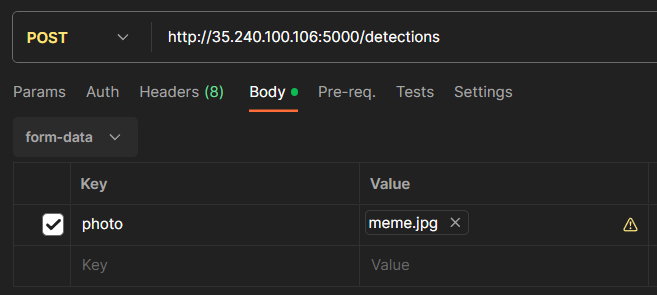

# Object-Recognition Project Documentation

## Table of contents
* [Server implementation details](#Object-recognition-server-setup)
* [App UI](#App-UI)
* [App implementation details](#App-implementation-details)

## Object recognition server setup

### Google Cloud parameters:
- C2-standard-8 VM instance
- 32 GB primary disk
- Ubuntu 22.04 LTS
- Static global IP address

### Server setup

#### Miniconda installation
https://docs.conda.io/projects/miniconda/en/latest/index.html#quick-command-line-install

#### Source code
https://github.com/theAIGuysCode/Object-Detection-API

Replace app.py in the project with the suitable version from our repository
```
cp [path to Object-Recognition]/server/app.py [path to Object-Detection-API]/app.py
```

Follow setup instruction from source code GitHub until weights loading (do not choose yolov3-tiny)

```
export PROTOCOL_BUFFERS_PYTHON_IMPLEMENTATION=python
python load_weigths.py
python app.py
```

## Server implementation details
### API request parameters

### API request example response
```json
{
    "response": [
        {
            "height": 54,
            "left": 59,
            "objectLabel": "cup 99.81",
            "top": 219,
            "width": 54
        },
        {
            "height": 342,
            "left": 120,
            "objectLabel": "person 99.77",
            "top": 40,
            "width": 278
        }
    ]
}
```
### API endpoint details
```python
@app.route('/detections', methods=['POST'])
def get_detections():
    raw_images = []
    image = request.files['photo']
    
    image_name = image.filename
    img_raw = tf.image.decode_image(image.read(), channels=3)
    raw_images.append(img_raw)
    
    # Create list for final response
    response = []
```
Transform image to match predefined size
```python

    raw_img = raw_images[0]
    num = 0
    img = tf.expand_dims(raw_img, 0)
    img = transform_images(img, size)
```
Detect objects on image
```python
    t1 = time.time()
    boxes, scores, classes, nums = yolo.predict(img)
    t2 = time.time()
    print('time: {}'.format(t2 - t1))
```
JSON creation loop
```python
    boxes, objectness, classes, nums = boxes[0], scores[0], classes[0], nums[0]
    wh = np.flip(img.shape[0:2])[0]
    # For each object detected
    for i in range(nums):
        # Top left corner
        x1y1 = tuple((np.array(boxes[i][0:2]) * wh).astype(np.int32))
        # Bottom right corner
        x2y2 = tuple((np.array(boxes[i][2:4]) * wh).astype(np.int32))
        # Label creation
        class_name = class_names[int(classes[i])]
        confidence = " {0:.2f}".format(np.array(objectness[i])*100)
        
        object = {
            "width": int(x2y2[0] - x1y1[0]),
            "height": int(x2y2[1] - x1y1[1]),
            "top": int(x1y1[1]),
            "left": int(x1y1[0]),
            "objectLabel": str(class_name + confidence)
        }
        response.append(object)
```
Return response
```python   
    try:
        return jsonify({"response":response}), 200
    except FileNotFoundError:
        abort(404)
```
## App UI

Our User Interface is very simple and intuitive.
You can navigate the app through a user-friendly drawer navigation system.
It consists of three screens: Home, Camera and AboutUs.

1. Home screen shows our logo and button that takes the user to Camera screen.

2. AboutUs screen describes our team and our product.

3. Camera screen is the main feature: it shows the preview of camera and bounding boxes of the recognized objects.


## App implementation details

### Screens and navigation
As previously mentioned, our app has threee screens and navigates with drawer navigation system.
Navigating to Camera Screen is also possible through CustomButton in Home Screen:

```js
const HomeScreenWithNavigation = ({ navigation }) => {
  const goToCameraScreenHandler = () => {
    navigation.navigate('Object Recognition');
  };

  return <HomeScreen onClickButton={goToCameraScreenHandler} />;
};
```

### Custom Components

#### CustomButton
The CustomButton component is used in HomeScreen to create button with customized text and color.

```js
function CustomButton({ title, onPress }) {
  return (
    <TouchableOpacity
      style={styles.button}
      onPress={onPress}
    >
      <Text style={styles.buttonText}>{title}</Text>
    </TouchableOpacity>
  );
}
```

#### BoundingBox
The BoundingBox component is responsible for rendering bounding boxes around recognized objects on the Camera screen. 

```js
function BoundingBox({ width, height, top, left, objectLabel }) {
    return (
        <View style={{ position: 'absolute', top: TOP_RATIO*top, left, flexDirection: 'row'}}>
            <View
                style={{
                    width: width*RATIO,
                    height: height*RATIO,
                    borderColor: '#5e0acc',
                    borderWidth: 2,
                }}
            />
            <Text style={{ color: '#5e0acc', position: 'absolute', bottom: height*RATIO, left: 0, padding: 2, backgroundColor: 'transparent' }}>
                {objectLabel}
            </Text>
        </View>
    );
}
```

### Server Requests

The app communicates with the server for object recognition using the axios library. 
The recognizeObjects function sends a photo to the server and processes the response to extract bounding box information.

```js
export async function recognizeObjects(photo) {
    let boundingBoxes = [];

    try {
        const formData = createPhotoFormData(photo);
        const response = await axios.post(BACKEND_URL, formData, {
            headers: {
                'Content-Type': 'multipart/form-data',
            },
        });
        if (response.status === 200) {
            boundingBoxes = getBoundingBoxesFromResponseData(response.data.response);
        } 
        else {
            console.error('Failed. HTTP status code:', response.status);
        }
    }
    catch (error) {
        console.error('Error:', error.message);
    }

    return boundingBoxes;
}
```
